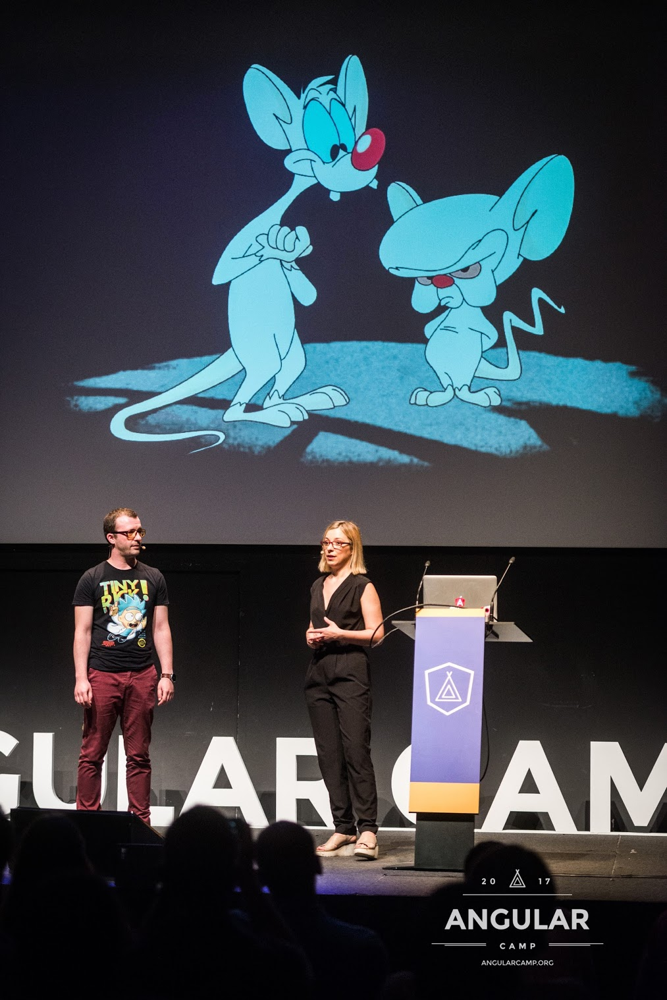

+++
title = "About Us"
date = 2020-03-07T16:32:04Z
draft = false
+++

Artur Daschevici Full Stack Engineer, Passionate about all things tech related, with wide area of expertise ranging from backend, DevOps, Front End, working with Django, React, React Native.
Artur is currently on a hiatus, working on independent projects. Part time speaker.

Find me on:

- [Twitter](https://twitter.com/arty_das)

- [GitHub](https://github.com/adaschevici)

- [LinkedIn](https://www.linkedin.com/in/artur-daschevici-b5404815/)

- [Web](https://artur.wtf)

Simona Cotin, Developer Advocate @ Microsoft
Simona Cotin is a web developer with a passion for teaching. She spends most of her time tinkering with JavaScript in the cloud and sharing her experience with other developers at community events like meetups and conferences or online. As a Cloud Developer Advocate, Simona engages with the web community to help create a great developer experience with Azure. She loves shipping code to production and has built network data analytics platforms using Angular, Typescript, React, and Node.

Find me on:

- [Twitter](https://twitter.com/simona_cotin)

- [GitHub](https://github.com/simonaco)

- [LinkedIn](https://www.linkedin.com/in/simona-cotin-2ba8747/)

---

Talks:
- [From Angular to React (and back again) Simona & Artur](https://www.youtube.com/watch?v=0n0qFcnLLnQ)

---
