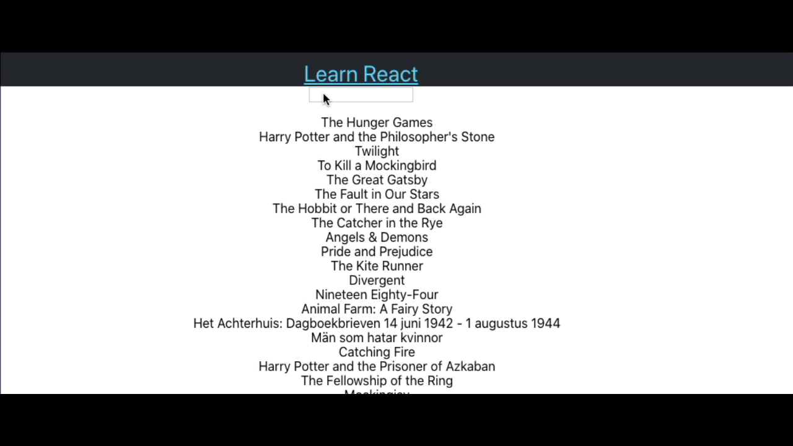

+++
title = "Case Study Web Workers"
date = 2020-05-13T17:19:42+01:00
weight = 4
draft = false
+++

A common requirement for a website could be to build an auto complete search box/omnibox. It's a feature that has come
to be expected of a decent UI. With a naive implementation you will notice that as the autocomplete dataset grows the
functionaliyty becomes very sluggish.

With the naive approach I used a prebuilt autocomplete component and a `react-virtualized`. For smaller autocompletion
sets this works fine so if you can narrow down the dataset, by all means do that. We are working with a 8k dataset so it
is not extremely big yet we can already see that it is slower.

## 2 eligible solutions

#### Offload to a server thread

What we want to do is create a server that is able to respond to `/search` requests. What this will do is that instead
of blocking the UI while the filtering of the data set is done, it will actually fire off a request and wil use the
results when they are returned. This gives the UI a more fluid, less janky feel.

This is a simple solution, with the downside being that you need to manage server side code as well which is not ideal
but due to the single threaded nature of the event loop it may be the best you can do in some cases.


stateDiagram
    [*] --> SearchBox: change event
    [*] --> SearchBox: change event
    [*] --> SearchBox: change event
    SearchBox --> SearchResultList: when state changes re-render
    SearchBox --> express: onChange make request to `/search`
    express --> SearchBox: respond to request and update state
    express --> SearchEngine: execute server side
    SearchEngine --> express: return with search results


The advantages with this are that you can hook in a proper search engine into the flow and of course the fact that your
UI is no longer janky.

The difference from the web worker approach is that not all the requests are handled and not all changes are reflected
in the result list but it is not as noticeable as the jankyness.

#### Web worker extravaganza

The web worker approach is the one where I perform all the computation on the client side. The filtering is offloaded to
scripts that can be executed in parallel by the browser in a similar manner to service workers.

The implementation is slightly more complex than the other choice and it also requires you to eject from the CRA which
is quite annoying but support for web-workers is quite good so if you have the __right reasons__ might as well implement
it this way.



The basic flow


stateDiagram
    [*] --> SearchBox: change event
    [*] --> SearchBox: change event
    [*] --> SearchBox: change event
    SearchBox --> SearchResultList: when state changes re-render
    SearchBox --> WorkerManager: onChange post message to WorkerArray
    WorkerManager --> Worker: spawn worker for each onChange
    Worker --> WorkerManager: returns array of results
    WorkerManager --> SearchBox: executes cb that updates state on SearchBox

